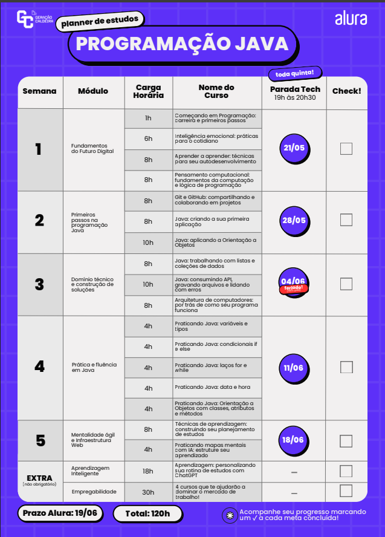

# 🚀 Trilha de Programação Java - Geração Caldeira 2026

Bem-vindo ao repositório central da minha jornada de desenvolvimento na trilha de **Programação Java** do Geração Caldeira, em parceria com a Alura. 

O objetivo deste espaço é centralizar toda a minha evolução técnica ao longo das 120 horas de formação teórica e prática, servindo como portfólio para a seleção da fase presencial no Instituto Caldeira em Porto Alegre.

## 🛠️ Tecnologias e Conceitos Explorados
* **Fundamentos:** Lógica de Programação, Pensamento Computacional e Inteligência Emocional.
* **Versionamento:** Git & GitHub (Fluxo de trabalho e boas práticas).
* **Linguagem Core:** Java (Sintaxe, Coleções, APIs, Tratamento de Erros).
* **Paradigma:** Orientação a Objetos (POO).

## 📅 Organização do Repositório
O projeto está estruturado em pastas semanais seguindo estritamente os módulos do Planner de Estudos oficial:
* `semana-01-fundamentos-do-futuro-digital/` (Lógica, Soft Skills e Git)
* `semana-02-primeiros-passos-na-programacao-java/` (Primeira aplicação e introdução à POO)
* `semana-03-dominio-tecnico-e-construcao-de-solucoes/` (Listas, APIs e Arquitetura)
* `semana-04-pratica-e-fluencia-em-java/` (Maratona de exercícios práticos)
* `semana-05-mentalidade-agil-e-infraestrutura-web/` (IA e metodologias de estudo)

## 📅 Planner de Estudos (Alura / Geração Caldeira)

Podes acompanhar a estrutura visual e os prazos das nossas metas no gráfico abaixo:

---
*Vamo dale! ☕*
